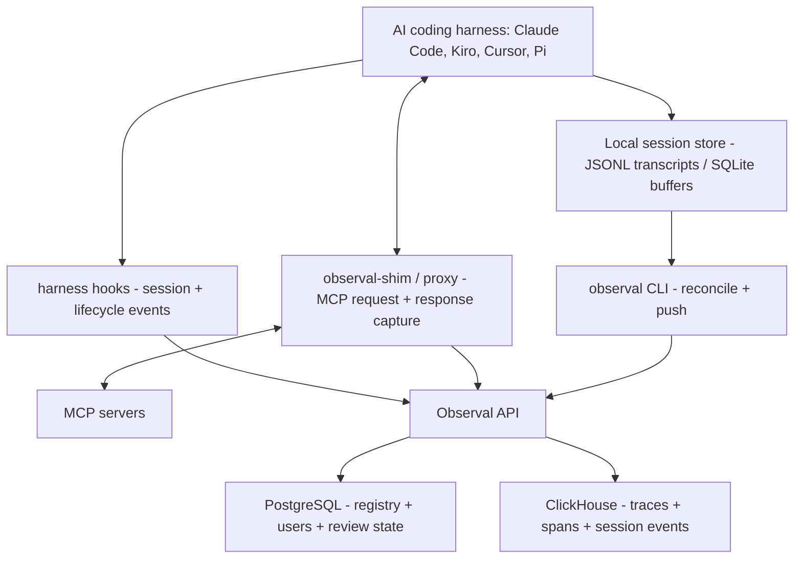

<!-- SPDX-FileCopyrightText: 2026 Apoorv Garg <apoorvgarg.21@gmail.com> -->
<!-- SPDX-FileCopyrightText: 2026 Hari Srinivasan <harisrini21@gmail.com> -->
<!-- SPDX-License-Identifier: AGPL-3.0-only -->

# Core Concepts

The vocabulary you need to be productive with Observal. Read once; every other page in these docs assumes you know these terms.

## The big picture



Observal collects agent activity through three complementary paths:

* **Session capture** reads the coding agent's local session files or SQLite buffers and reconciles them into normalized traces.
* **harness hooks** capture lifecycle events such as session start, user prompt, tool use, stop, and notifications when the harness exposes them.
* **MCP shims and proxies** capture MCP requests and responses without modifying the traffic.

Two data stores, two concerns:

* **Postgres** holds the *registry*: users, accounts, agent configs, MCP listings, review state, and alert rules. Transactional, relational.
* **ClickHouse** holds the *telemetry*: traces, spans, and session events. High-volume, time-series, fast analytical queries.

## The registry

Six component types. Agents bundle the other five.

| Type | What it is |
| --- | --- |
| **Agent** | A complete, installable AI agent. Bundles MCP servers, skills, hooks, prompts, and sandboxes into one YAML. |
| **MCP Server** | A [Model Context Protocol](https://modelcontextprotocol.io/) server, the tools an agent can call. |
| **Skill** | A portable instruction package agents load on demand. |
| **Hook** | A lifecycle callback that runs on session start, tool use, session end, etc. |
| **Prompt** | A named, parameterized prompt template with variable substitution. |
| **Sandbox** | A Docker execution environment for running code the agent generates. |

Anyone can publish. Admin review controls what appears in the public listing, but your own items are usable immediately without approval.

## Telemetry: traces, spans, sessions

### Span

A single operation. Typically one MCP tool call or lifecycle event. Includes the name, input/output metadata, latency, status, and any error. Spans can nest via `parent_span_id`.

### Trace

A top-level operation that can contain many spans. Most traces are a single agent turn (one user prompt → the agent's response). Identified by `trace_id`.

### Session

A logical grouping of related traces, typically one harness session or one user task. Identified by `session_id` in trace metadata. A long Claude Code session produces many traces that all share a `session_id`.

## The shim and the proxy

Observal intercepts MCP traffic without modifying it. Two flavors:

| Component | Transport | When it's used |
| --- | --- | --- |
| `observal-shim` | stdio | The default for most MCP servers. Wraps the MCP server process and forwards stdin/stdout. |
| `observal-proxy` | HTTP / SSE / streamable-HTTP | Used when an MCP server speaks HTTP instead of stdio. |

You rarely call either one directly. `observal doctor patch --shim` (or `--all`) rewrites your harness config to route MCP servers through the appropriate one.

Interception is **transparent**: nothing is changed on the wire. If Observal is unreachable, the tool call still succeeds, and the telemetry is queued locally (see [Telemetry buffer](#telemetry-buffer) below) and flushed later.

## Telemetry buffer

When the Observal server is unreachable, the CLI and shim don't drop telemetry. Events are queued in a local SQLite buffer at `~/.observal/telemetry_buffer.db` and flushed the next time the server is reachable.

Check the buffer:

```bash
observal auth status
observal ops telemetry status
```

Flush manually:

```bash
observal ops sync
```

## Deployment mode

Two server-side modes, controlled by the `DEPLOYMENT_MODE` environment variable:

| Mode | Self-registration | Bootstrap | Auth |
| --- | --- | --- | --- |
| `local` (default) | Yes | Yes (fresh server creates admin on first login) | Email + password or API key |
| `enterprise` | No | No | SSO / OIDC only |

You pick this when you set up the server. Most self-hosters use `local`.

## Next

→ [Use Cases](../use-cases/README.md) to see what you can actually do with all of this.
