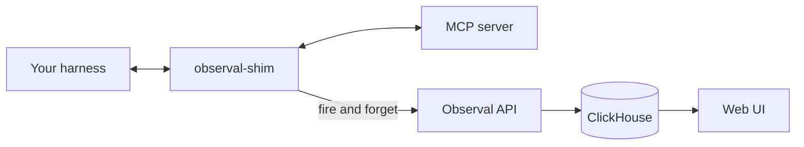

<!-- SPDX-FileCopyrightText: 2026 Apoorv Garg <apoorvgarg.21@gmail.com> -->
<!-- SPDX-FileCopyrightText: 2026 Hari Srinivasan <harisrini21@gmail.com> -->
<!-- SPDX-FileCopyrightText: 2026 Lokesh Selvam <lokeshselvam7025@gmail.com> -->
<!-- SPDX-FileCopyrightText: 2026 Shaan Narendran <shaannaren06@gmail.com> -->
<!-- SPDX-FileCopyrightText: 2026 tsitu0 <tomsitu0102@gmail.com> -->
<!-- SPDX-License-Identifier: AGPL-3.0-only -->

# Quickstart

Go from zero to "my first trace in the Observal dashboard" in about five minutes. This assumes you have Docker running.

By the end of this guide you will have:

- The Observal CLI installed
- An Observal server running locally
- The CLI logged in as an admin
- At least one MCP server instrumented
- A live trace visible in the web UI

## 1. Install the CLI

```bash
curl -fsSL https://raw.githubusercontent.com/BlazeUp-AI/Observal/main/install.sh | bash
```

No Python required. For alternative install methods, see [Installation](installation.md).

> [!NOTE]
> You need Docker Engine ≥ 24.0 with Compose v2 (`docker compose`, not `docker-compose`). Homebrew's Docker formula is outdated. Install [Docker Desktop](https://docs.docker.com/get-docker/) or use your distro's upstream packages. Verify with `docker version` and `docker compose version`.

## 2. Start the server

```bash
git clone https://github.com/BlazeUp-AI/Observal.git
cd Observal
cp .env.example .env

docker compose -f docker/docker-compose.yml up --build -d
```

That's it. The `.env.example` ships with working defaults. The core services come up:

| Service               | URL                     | Purpose                        |
| --------------------- | ----------------------- | ------------------------------ |
| `observal-lb` (nginx) | `http://localhost`      | Reverse proxy (API + Web)      |
| `observal-web`        | `http://localhost:3000` | Web UI (Next.js, direct)       |
| `observal-api`        | internal                | FastAPI backend               |
| `observal-worker`     | internal                | Background jobs (arq)          |
| `observal-init`       | internal                | Runs DB migrations, then exits |
| `observal-db`         | `localhost:5432`        | PostgreSQL 16                  |
| `observal-clickhouse` | `localhost:8123`        | ClickHouse                     |
| `observal-redis`      | `localhost:6379`        | Redis                          |

Optional monitoring can be enabled with `make up-prometheus` or `make up-observability`. Prometheus listens on `http://localhost:9090`; Grafana listens on `http://localhost:3001` when the Grafana profile is enabled.

The API waits for Postgres, ClickHouse, and Redis to pass health checks before starting. Expect 15–30 seconds. Confirm it is up:

```bash
curl http://localhost/health
# → {"status": "ok"}
```

Hitting a port conflict? See [Self-Hosting → Ports and volumes](../self-hosting/ports-and-volumes.md).

## 3. Log in

```bash
observal auth login
```

Prompts:

1. **Server URL**: press Enter for `http://localhost`
2. **Login method**: pick `[E]mail`
3. **Email / password**: use one of the seeded demo accounts:

| Role        | Email                   | Password            |
| ----------- | ----------------------- | ------------------- |
| Super Admin | `super@demo.example`    | `super-changeme`    |
| Admin       | `admin@demo.example`    | `admin-changeme`    |
| Reviewer    | `reviewer@demo.example` | `reviewer-changeme` |
| User        | `user@demo.example`     | `user-changeme`     |

Log in as super admin for the fewest restrictions while exploring. Credentials land in `~/.observal/config.json` (mode `0600`).

Check it worked:

```bash
observal auth whoami
# → super@demo.example (super_admin)
```

## 4. Discover and instrument your harness

If you already have MCP servers configured in Claude Code, Kiro, Cursor, VS Code, or Gemini CLI, first see what's there:

```bash
observal scan
```

Expected output:

```
Claude Code (~/.claude/settings.json)
  filesystem        npx @modelcontextprotocol/server-filesystem   not wrapped
  github            npx @modelcontextprotocol/server-github       not wrapped

Kiro (.kiro/settings/mcp.json)
  mcp-obsidian      mcp-obsidian                                  not wrapped

2 harness(s) found, 3 MCP server(s) total, 0 wrapped.
```

`scan` is read-only -- it shows what you have without modifying anything. Now instrument everything:

```bash
observal doctor patch --all --all-harnesses
```

Expected output:

```
Patching Claude Code...
  ✓ filesystem        wrapped  (was: npx @modelcontextprotocol/server-filesystem)
  ✓ github            wrapped  (was: npx @modelcontextprotocol/server-github)
  ✓ Telemetry hooks installed

Patching Kiro...
  ✓ mcp-obsidian      wrapped
  ✓ Telemetry hooks installed

Backups saved:
  ~/.claude/settings.json.20260421_143055.bak
  .kiro/settings/mcp.json.20260421_143055.bak

3 server(s) instrumented, hooks installed across 2 harness(s).
```

What `doctor patch --all` did:

- Found your existing MCP config files (`~/.claude/settings.json`, `.kiro/settings/mcp.json`, `.cursor/mcp.json`, etc.)
- Rewrote the config so every MCP server runs through `observal-shim` (transparent -- no behavior change)
- Installed telemetry hooks for session lifecycle events
- Saved a timestamped `.bak` next to every file it touched

Nothing broke. Your agents still work exactly as before. The only difference: every tool call now generates a span.

Restart your harness to pick up the new config. The next MCP call will produce a trace.

## 5. See your first trace

Open `http://localhost/traces` in your browser. Trigger anything in your harness that uses an MCP tool (ask Claude to list files, read a GitHub issue, whatever). Refresh, and you'll see the trace appear.

Or use the CLI:

```bash
observal ops traces --limit 5
```

Drill in:

```bash
observal ops spans <trace-id>
```

## 6. (Optional) Pull an agent

Browse what the community has published:

```bash
observal agent list
observal agent show <agent-name>
```

Install one into your harness:

```bash
observal agent pull <agent-name> --harness <harness-name>
```

This drops agent files, skills, hooks, and MCP configs into the right places for your harness and wires up telemetry automatically.

## What you just built



Every MCP request/response is now a span. Spans group into traces. Traces form sessions.

## Where to next

| You want to...                      | Go to                                     |
| ----------------------------------- | ----------------------------------------- |
| Understand the data model           | [Core Concepts](core-concepts.md)         |
| Learn what to do with traces        | [Use Cases](../use-cases/README.md)       |
| Configure the server for production | [Self-Hosting](../self-hosting/README.md) |
| Deep-dive on a CLI command          | [CLI Reference](../cli/README.md)         |
