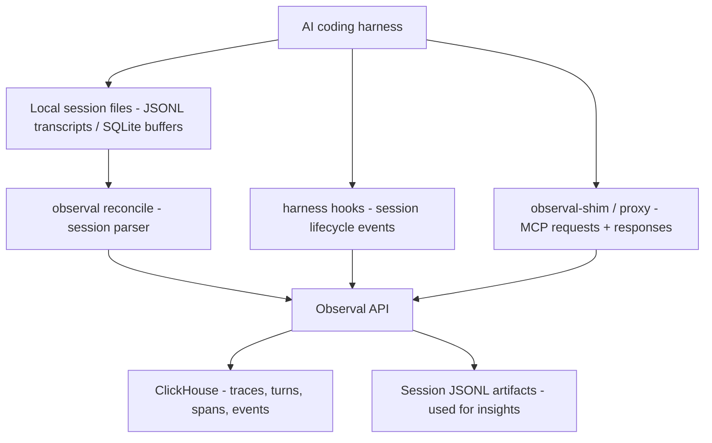

<!-- SPDX-FileCopyrightText: 2026 Apoorv Garg <apoorvgarg.21@gmail.com> -->
<!-- SPDX-FileCopyrightText: 2026 Hari Srinivasan <harisrini21@gmail.com> -->
<!-- SPDX-FileCopyrightText: 2026 tsitu0 <tomsitu0102@gmail.com> -->
<!-- SPDX-License-Identifier: AGPL-3.0-only -->

# Telemetry pipeline

How agent session data becomes traces, turns, spans, and insight-ready session artifacts in Observal.

## Three capture paths



Observal presents activity in the UI as **sessions**, **traces / turns**, and **spans**:

- A **session** is a full coding-agent conversation or task window.
- A **trace / turn** is usually one user prompt and the agent work that follows.
- A **span** is one operation inside a turn, commonly a tool call, MCP request, hook event, model step, or parser event.

For insights, Observal also keeps session-shaped artifacts derived from the agent's JSONL transcripts or SQLite session buffers. Those richer session artifacts let the insights engine reason about the conversation in order, while ClickHouse stores the normalized analytical layer used by trace views, dashboards, and queries.

## Path 1: session files and SQLite buffers

This is the primary path for full-session reconstruction. Coding agents write local session state as JSONL transcripts, SQLite buffers, or equivalent local history. `observal reconcile` parses those files and pushes normalized sessions to the server.

This path gives Observal the full conversation shape needed for insight reports: prompts, assistant messages, tool calls, timing, and ordering.

## Path 2: harness hooks

Hooks capture lifecycle events as they happen:

- `SessionStart` / `Stop`: session boundaries
- `UserPromptSubmit`: user prompt boundaries
- `PreToolUse` / `PostToolUse`: tool calls when the harness exposes them
- `SubagentStop`: Claude Code sub-agent lifecycle
- `Notification`: harness notifications

Full schema and handler types: [Hooks specification](../reference/hooks-spec.md).

`observal agent pull` and `observal doctor patch --hook` wire hooks into the appropriate file:

- Claude Code: `~/.claude/settings.json`
- Kiro: agent JSON at `.kiro/agents/<name>.json` or `~/.kiro/agents/<name>.json`

## Path 3: MCP shim and proxy traffic

The shim and proxy are transparent interceptors that forward MCP traffic unchanged while recording MCP requests and responses asynchronously.

Operational knobs:

- **Server address**: `OBSERVAL_SERVER_URL` on the CLI user's machine. The shim picks this up from `~/.observal/config.json` or the env var.
- **API key**: the shim uses the user's stored credentials. No extra setup.
- **Offline behavior**: if the server is unreachable, telemetry is buffered at `~/.observal/telemetry_buffer.db` and flushed later. Flush manually with `observal ops sync`. Check the buffer size with `observal auth status`.

## High-volume tuning

For teams generating thousands of spans per minute:

1. **ClickHouse writes.** Observal batches inserts already. If you see ingest backpressure, bump `CLICKHOUSE_*` memory limits or consider external ClickHouse.
2. **Redis queue.** `arq` uses Redis for the background job queue. Redis at 256 MB is fine for most deployments.
3. **Session artifacts.** Keep retention aligned with your insights needs. Sessions are richer than spans and can grow quickly for long coding-agent conversations.

## Verifying the pipeline

```bash
# Fire a test event from the CLI
observal ops telemetry test

# Confirm arrival
observal ops telemetry status
observal ops traces --limit 5
```

End-to-end smoke test done.
